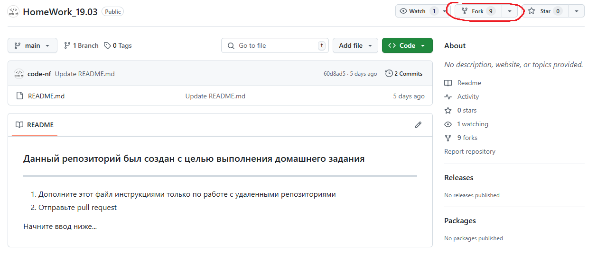
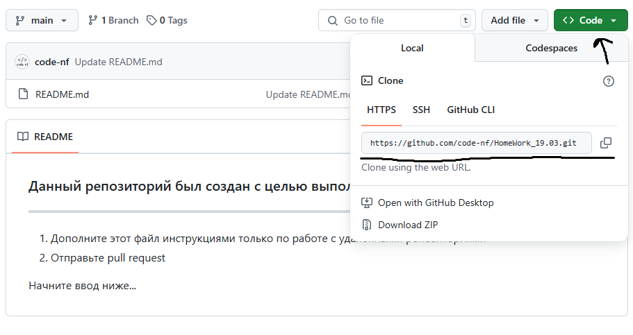
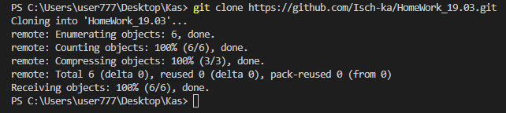
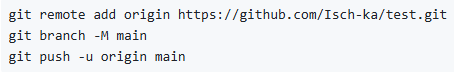
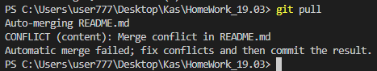

# Что такое Git?

Git — это система контроля версий, которая помогает отслеживать историю изменений в файлах. Она позволяет нескольким разработчикам одновременно работать над одним продуктом.

Git хранит все версии проекта (коммиты) и даёт возможность откатить текущую версию кода до предыдущей или сразу на несколько шагов назад. Это удобно, если после изменения коммита допущена ошибка.

Git — это программа, которую нужно установить и подключить к проекту для управления системой контроля версий. Например, можно установить её на сервер и настроить удалённую работу самостоятельно, а можно воспользоваться готовыми сервисами, самый популярный из которых — GitHub.

GitHub — это сайт-хранилище для историй версий проектов: нужно подключить Git, зарегистрироваться на GitHub, создать там онлайн-репозиторий и перенести туда файлы из своего репозитория.

# Установка Git и Visual Studio Code

Установка Git зависит от операционной системы:

* Для Windows. Перейдите на официальный сайт Git в раздел загрузок. Выберите Standalone-версию и запустите скачанный файл. На первом экране выберите компоненты для установки. Если нужны дополнительные иконки на рабочем столе или ежедневная проверка наличия новой версии, отметьте соответствующие опции. Остальные параметры лучше оставить по умолчанию.
* Для macOS. Установите Homebrew и выполните команду brew install git. Чтобы обновить установку Git, используйте параметр обновления Homebrew: brew upgrade git. Графический установщик для Git на macOS также доступен на официальном веб-сайте Git.
* Для Linux. Используйте собственную систему управления пакетами дистрибутива Linux для установки и обновления Git. Например, в Ubuntu: sudo apt-get install git.

После установки Git доступен из командной строки или PowerShell. Рекомендуется выбрать значения по умолчанию во время установки, если их не нужно изменить.

➤Установка Git для Windows, MAC, Linux: 
https://git-scm.com/downloads

➤Установка VSCode для Windows, MAC, Linux: https://code.visualstudio.com/Download

При первом использовании Git необходимо представиться.  Для 
этого нужно ввести в терминале 2 команды:

```git config --global user.name «Ваше имя английскими буквами»```

```git config --global user.email ваша почта@example.com```


## Подготовка репозитория
* Создать папку в необходимом репозитории компьютера
* Перейти с помощью проводника в **Visual Studio Code** в созданную папку
* Инициализировать репозиторий в терминале командой ```git init```


  
## Создание коммитов
### Git add
Для добавление изменений в коммит используется команда ```git add``` и имя файла<br>
Например, ```git add README.md```


### Оправить коммит
```git commit -m "first commit"``` - команда для отправки коммита<br>
* ```git commit``` - обращение к **GIT**
* ```-m``` - добавить сообщение *(коментарий)*
* ```"first commit"``` - коментрарий *(в кавычках)*


### Посмотреть список коммитов
* ```git log``` - стандартный вид


* ```git log --graph``` - вид с графическим отображением веток


Чтобы отсюда выйти, нажмите q

### Перейти к сохранению
* ```git checkout```
* ```git checkout <номер коммита, первые 4 символа>``` - перейти к определенному изменению


* ```git checkout master``` - перейти к изменению последнего коммита


### Посмотреть есть ли не сохранненные изменения репозитория (файлов)
* ```get status```

 - есть не сохранненные изменения
 - нет не сохранненных изменений (все изменения сохранены)

## Работа с ветками
* ```git branch``` - посмотреть список веток


* ```git branch <название ветки>``` - создать ветку (новая ветка унаследует коммиты родительской ветки)


* ```git checkout <название ветки>``` - перейти на ветку


* ```git branch -d <название ветки>``` - удалить ветку после merge
* ```git branch -D <название ветки>``` - удалить ветку принудительно


* ```git merge <название сливаемой ветки>``` - сливание веток


При данном действии, если на одних и тех же строчках сливаемых веток будет разная информация, произойдёт конфликт: Git не сможет определиться сам, какую информацию ему оставить, какую убрать, потому попросит вас сделать это самостоятельно.


# Работа с удалёнными репозиториями

Что бы сохранить к себе чей-то репозиторий, нужно жмать Fork, который должен находится выше от него (чужого репозитория).



После того, как чужой репозиторий теперь ваш, и вы хотите с ним работать локально (через VS Code), вам надо их связать (VS Code с репозиторием)! Для этого заходите в VS Code и пишите в терминале ```git clone (ссылка на репозиторий, который хотите привязать)```.





Теперь, когда репозиторий привязан и отображается у вас в VS Code, переключитесь на него командой ```cd (имя репозитория)```, чтобы потом редактировать.


Команды, которые переносят отредактированную локально (в VS Code) информацию на Github:



А командa ```git pull``` перенесёт отредактированную на Github информацию в VS Code, а также сольёт всю информацию в единую:



# Ещё немного Git-команд
* ```git diff```. Используется для вычисления разницы между любыми двумя Git-деревьями. 
* ```git reset```. Используется для отмены изменений. 
* ```git rm```. Используется в Git для удаления файлов из индекса и рабочей директории. 
* ```git mv```. Это удобный способ переместить файл, а затем выполнить git add для нового файла и git rm для старого. 
* ```git clear```. Используется для удаления мусора из рабочей директории. 
* ```git stash```. Используется для временного сохранения всех незакоммиченных изменений для очистки рабочей директории без необходимости коммитить незавершённую работу в новую ветку. 
* ```git tag```. Используется для задания постоянной метки на какой-либо момент в истории проекта. Обычно она используется для релизов. 
* ```git fetch```. Связывается с удалённым репозиторием и забирает из него все изменения, которых у пользователя пока нет, и сохраняет их локально. 

# Синтаксис языка Markdown

## Параграфы и разрывы строк (paragraphs and line breaks)

Чтобы поделить текст на параграфы, между ними нужно оставить пустую строку. Строка считается пустой, даже если в ней есть пробелы и табуляции. Если же строки находятся рядом, то они автоматически склеиваются в одну.

Пример 1

Пример 2

Пример 1
Пример 2

Для переноса строки внутри одного параграфа есть три метода:

поставить в конце строки два или больше пробела   
поставить в конце строки обратную косую черту \
использовать HTML-тег <br>

Перенос с помощью пробелов  
Перенос с помощью обратного слеша\
Перенос с помощью тега <br> Последняя строка

## Заголовки (headings)

Чтобы выделить заголовок необходимо перед его название поставить значок "#":

Количество символов “#” задаёт уровень заголовка  
(поддерживается 6 уровней)

# Пример 1
## Пример 2
### Пример 3
#### Пример 4
##### Пример 5
###### Пример 6

У заголовков первого и второго уровня есть альтернативный способ выделения: на следующей строке после них нужно поставить знаки равенства = или дефисы -. Вот несколько правил:

знак = применяется для заголовков H1;
дефис применяется для заголовков H2;
если в одной строке поставить оба знака, то работать ничего не будет;
можно ставить любое количество знаков, и на тип заголовка это не повлияет;
между заголовком и знаками не должно быть пустых строк.

Заголовок первого уровня
=
Заголовок первого уровня
=========
Заголовок второго уровня
-
Заголовок второго уровня
----------

## Жирный (bold)

Чтобы сделать тикст жирным необходимо обрамить его с двух сторон символами "**" или "__":

**Жирный** / __Жирный__

## Курсив (italic)

Чтобы создать курсив необходимо обрамить текст с двух сторон символами "*" или "_":

*Курсив* / _Курсив_

## Жирный курсив (bold and italic)

Чтобы создать жирное курсивное начертание необходимо обрамить текст с двух сторон символом "***":

 ***Жирное курсивное начертание***

  ## Зачёркнутый (strikethrough)

 Чтобы создать зачёркнутый текст необходимо обрамить его с двух сторон символом "~~":

 ~~Зачёркнутый текст~~

 ## Подчёркнутый (underline)

 В синтаксисе Markdown нет встроенного способа подчеркнуть текст. Но если ваш редактор поддерживает HTML, то можно использовать теги:

 <u>Подчёркнутый текст</u>

 ## Разделители (horizontal rules)

 Чтобы оформить горизонтальный разделитель, нужно поставить три или больше специальных символа: звёздочки "*", дефиса "-" или нижних подчёркивания "_". Они должны находиться на отдельной строке, и между ними можно ставить любое количество пробелов и табуляций.

Если ваш редактор поддерживает HTML-теги, то для разметки можно также использовать тег <hr>

***
---
___
*	*  **


## Цитаты (blockquotes)

Чтобы параграф отобразился как цитата, нужно поставить перед ним закрывающую угловую скобку ">".

> Оформление цитатой
последовательных строк
внутри одного параграфа

Внутрь одного блока цитаты можно поместить сразу несколько параграфов и использовать любые элементы оформления. Чтобы сделать это, нужно поместить закрывающую угловую скобку перед началом каждой строки.

> # Заголовок
> Первый параграф
>
> Второй параграф
>
> > Вложенная цитата
> > > Цитата третьего уровня
>
> Продолжение основной цитаты

  ## Нумерованные списки (ordered)

 Для создания нумерованного списка перед пунктами нужно поставить число с точкой. При этом нумерация в разметке ленивая. Неважно, какие именно числа вы напишете: Markdown пронумерует список автоматически.
1. Первый пункт
2. Второй пункт
3. Третий пункт


1. Первый пункт
1. Второй пункт
1. Третий пункт


1. Первый пункт
73. Второй пункт
5. Третий пункт

Список можно начинать и не с единицы. Для нумерации важно только число, которое стоит перед первым пунктом.

27. Первый пункт
27. Второй пункт
27. Третий пункт

Обратите внимание, что между двумя нумерованными списками, идущими подряд, нужно отбить две пустые строки. Если отбить только одну, то Markdown воспримет два списка как один. Некоторые редакторы в таком случае увеличивают интервал между пунктами.

1. Первый пункт
2. Второй пункт
3. Третий пункт

1. Четвёртый пункт
2. Пятый пункт
3. Шестой пункт

## Ненумерованные (unordered)
 
Для создания ненумерованного списка нужно поставить перед каждым пунктом звёздочку "*", дефис "-" или плюс "+".

* Первый пункт
* Второй пункт
* Третий пункт
- Первый пункт
- Второй пункт
- Третий пункт
+ Первый пункт
+ Второй пункт
+ Третий пункт

Обратите внимание, что Markdown относит к разным спискам пункты, перед которыми стоят разные маркеры. Даже несмотря на то, что мы не оставляем пустых строк между списками.

Если же два списка идут подряд, а перед их пунктами стоят одинаковые маркеры, тогда между ними нужно отбить две пустые строки (как в случае с нумерованными списками).

## Чекбоксы (checkboxes)

Чтобы сделать чекбоксы, нужно использовать маркированный список, но между маркером и текстом поставить [x] для отмеченного пункта и [] — для неотмеченного.

Чекбоксы доступны в диалекте GitHub Flavored Markdown (тот самый, который умеет зачёркивать текст) и поддерживаются не всеми редакторами Markdown.

- [x] Отмеченный пункт
- [ ] Неотмеченный пункт

## Вложенные (nested)

Чтобы создать вложенный список, нужно поставить перед его пунктами табуляцию или несколько пробелов. В Markdown одна табуляция соответствует четырём пробелам.

Список одного вида можно вкладывать в любой другой.

1. Пункт
	1. Подпункт
		1. Подподпункт

- Пункт
	- Подпункт
		- Подподпункт


1. Пункт
	- Подпункт
		* Подподпункт

+ Пункт
	1. Подпункт

- Пункт
  - [x] Отмеченный подпункт
  - [ ] Неотмеченный подпункт
    1. Подподпункт

На самом деле количество пробелов, которые нужно поставить для корректного отступа, рассчитывается чуть сложнее. Берётся количество символов в маркере (один для "*", "-" и "+", два для "1.", три для 10.), и к нему прибавляется любое число от 1 до 4.

Таким образом, если в маркере 1 символ, нужно поставить от 2 до 5 пробелов, если 2 символа — от 3 до 6, если 3 символа — от 4 до 7.

## Другие элементы внутри списков

В пункты списков можно добавлять другие элементы оформления. Например, параграфы или цитаты. Для этого нужно сделать отступ, как если бы вы добавляли вложенный список.

1. Первый пункт
	> Цитата внутри первого пункта
1. Второй пункт
 	
    Параграф внутри второго пункта
1. Третий пункт

## Ссылки (links)

Самый лёгкий способ поместить ссылку в Markdown — заключить её в угловые скобки. Несмотря на простоту, он не является основным и был добавлен только в спецификации CommonMark.

<https://skillbox.ru/media/code/>

Чтобы оформить ссылкой часть текста, используется такой синтаксис: [текст](ссылка). Можно сделать всплывающую подсказку при наведении курсора. Для этого в круглых скобках после ссылки нужно поставить пробел и написать текст подсказки в кавычках.

[Skillbox Media](https://skillbox.ru/media/) без подсказки

[Skillbox Media](https://skillbox.ru/media/ "Круто, не правда ли?)") с подсказкой

Ещё один способ оформить ссылку — справочный. Он работает как сноски в книгах: [текст][имя сноски]. При таком способе организации ссылок в конце документа нужно также написать и оформить саму сноску: [имя сноски]: ссылка. При желании после ссылки можно добавить подсказку — точно так же, как в предыдущем методе.

Имя сноски может быть любым сочетанием символов: цифрами, буквами и даже знаками препинания. На одну и ту же сноску в тексте можно ссылаться сколько угодно раз.

Ссылки, оформленные справочным методом, выглядят и работают точно так же, как и в предыдущем способе. Сами сноски в отформатированном документе не отображаются.

[Skillbox Media][1]

[Раздел «Код»][code]


[1]: https://skillbox.ru/media "А это ещё круче!"
[code]: https://skillbox.ru/media/code/

## Картинки (images)

Изображения в Markdown оформляются по принципу, схожему с принципом оформления ссылкок, только перед квадратными скобками нужно поставить восклицательный знак: . Здесь также можно сделать всплывающую подсказку.


Можно использовать и справочный метод: ![текст][имя сноски]. Сноски оформляются так же, как и в ссылках: [имя сноски]: путь к изображению, — в них тоже можно добавлять подсказки.

![Изображение][1]


[1]: https://upload.wikimedia.org/wikipedia/commons/thumb/4/48/Markdown-mark.svg/1920px-Markdown-mark.svg.png "Логотип Markdown"

## Вставка кода (code)

В Markdown есть несколько способов выделить исходный код:

* Если надо отобразить фрагмент кода внутри строки с каким-то текстом, нужно с двух сторон выделить этот код одним или несколькими обратными апострофами (`; их ещё называют бэктиками).
* Чтобы выделить фрагмент из нескольких строк, нужно с двух сторон выделить его тремя обратными апострофами.
* Также перед фрагментом кода можно поставить табуляцию или четыре пробела, при этом предыдущая строка должна быть пустой.

Функция `print (x)` выводит содержимое переменной ```x```.

```
#include <stdio.h>
int main() {
   printf("Hello, World!");
   return 0;
}
```

	let x = 12;
	let y = 6;
	console.log(x + y);

 Если обрамлять код тремя обратными апострофами, то после первой тройки можно указать язык программирования — тогда Markdown правильно подсветит элементы кода.

 ```python
if x > 0:
	print (x)
else:
	print ('Hello, World!')
```

```c
#include <stdio.h>
int main() {
   printf("Hello, World!");
   return 0;
}
```

```javascript
let x = 12;
let y = 6;
console.log(x + y);
```

## Таблицы (tables)

В уже упомянутом выше диалекте GitHub Flavored Markdown (и некоторых других тоже) есть возможность оформлять таблицы. Столбцы разделяются вертикальными линиями |, а строка с шапкой отделяется от остальных дефисами -, которых можно ставить сколько угодно.

|Столбец 1|Столбец 2|Столбец 3|
|-|--------|---|
|Длинная запись в первом столбце|Запись в столбце 2|Запись в столбце 3|
|Кртк зпс| |Слева нет записи|

Чтобы выровнять весь столбец по правому краю, в строке с дефисами сразу после дефисов можно поставить двоеточие :. Чтобы выровнять содержимое по центру, надо поставить двоеточия с обеих сторон.

|Столбец 1|Столбец 2|Столбец 3|
|:-|:-:|-:|
|Равнение по левому краю|Равнение по центру|Равнение по правому краю|
|Запись|Запись|Запись|

## Резюмируем

Синтаксис Markdown простой, гибкий и нетребовательный. У него есть несколько реализаций, благодаря которым в нём можно:

* выделять параграфы и переносить строки,
* оформлять заголовки,
* изменять начертание текста,
* ставить горизонтальные разделители,
* выделять цитаты,
* составлять списки,
* прикреплять ссылки,
* вставлять картинки и исходный код,
* делать таблицы.

И ещё одно небольшое примечание. Если вы форматируете текст с помощью HTML-тегов или форматируете код тремя обратными апострофами, то Markdown будет автоматически пытаться искать закрывающий символ — то есть будет придумывать, куда его поставить, даже если у вас его нет. Остальные симметричные символы (*_~`) работают в пределах одной строки.
